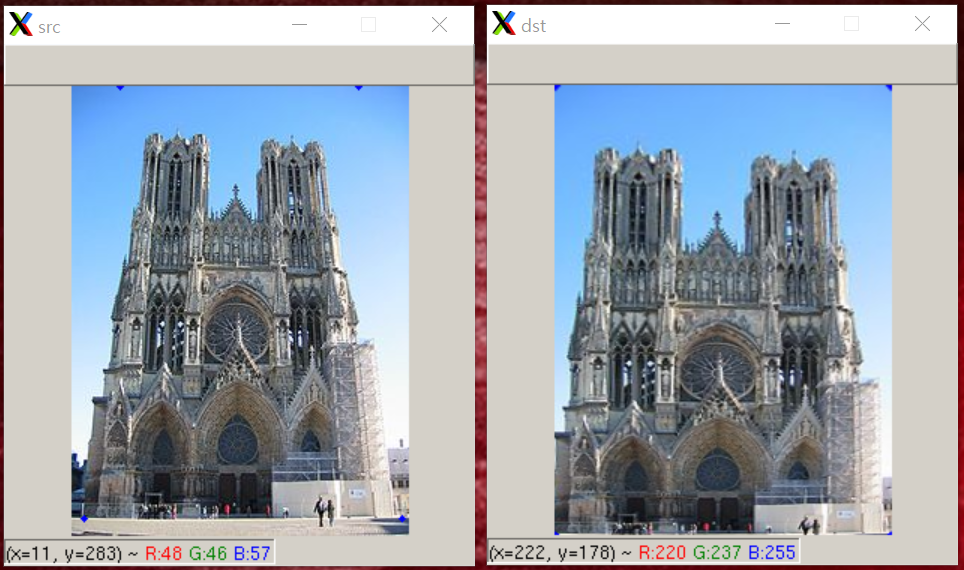

# PerspectiveControl
Python,OpenCV,ImageProcessing

## Sample image

## How to use
### Mouse left button double click 
- Clear warping points
### Mouse left button down
- Add one point
- Need to add 4 rectangle points on src image window
- (top/left) -> (top/right) -> (bottom/right) -> (bottom/left)
### ESC
- Exit program
